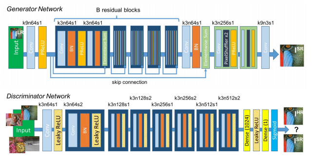
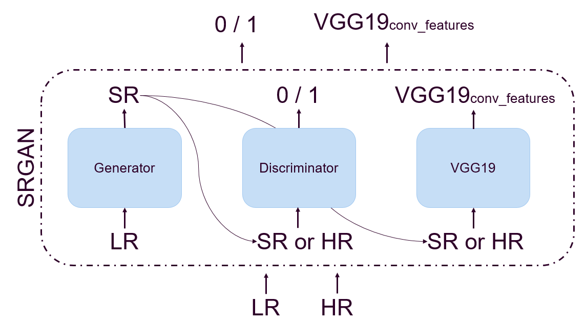
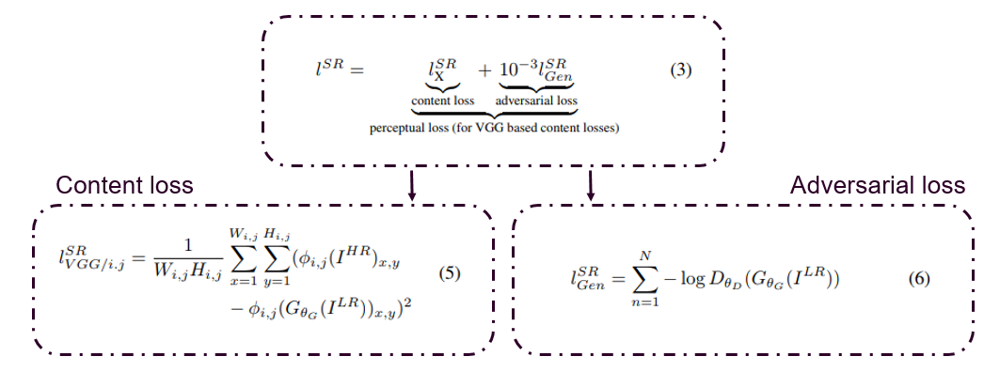

# SRGAN-Keras
Keras implementation of ["Photo-Realistic Single Image Super-Resolution Using a Generative Adversarial Network"](https://arxiv.org/abs/1609.04802)


## 1. Architecture
The generator creates a high-resolution (HR) image (4x upscaled) from a corresponding low-resolution (LR) image. The discriminator distinguishes the generated (fake) HR images from the original HR images.

### 1.1. Generator & Discriminator


[Figure 4 from paper](https://arxiv.org/abs/1609.04802): Architecture of Generator and Discriminator Network with corresponding kernel size (k), number of feature maps
(n) and stride (s) indicated for each convolutional layer.

### 1.2. Overview of input / outputs


**Code Overview**: Overview of the three networks; generator, discriminator, and VGG19. Generator create SR image from LR, discriminator predicts whether it's a SR or original HR, and VGG19 extracts features from generated SR and original HR images. 

## 2. Content & Adversarial Loss


**Losses Overview**: The perceptual loss is a combination of content loss (based on VGG19 features) and adversarial loss. Equations are taken directly from ["original paper"](https://arxiv.org/abs/1609.04802).

## 3. Using this repository

### 3.1. Training
A command-line interface can be found in `train.py`. To train run e.g.:
```
python train.py \
    --train <TRAINING_IMAGES_PATH> \
    --validation <VALIDATION_IMAGES_PATH> \
    --scale 4 \
    --test_path images/samples_4X \
    --stage all
```

### 3.2. Testing
Check the example_usage notebook: [example_usage.ipynb](./Example_Usage.ipynb)