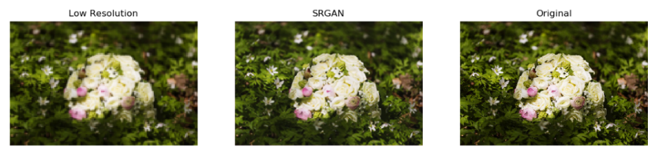

# SRGAN-Keras
Keras implementation of ["Photo-Realistic Single Image Super-Resolution Using a Generative Adversarial Network"](https://arxiv.org/abs/1609.04802)

## Architecture
The generator creates a high-resolution (HR) image (4x upscaled) from a corresponding low-resolution (LR) image. The discriminator distinguishes the generated (fake) HR images from the original HR images.

__[Figure 4 from paper](https://arxiv.org/abs/1609.04802):__ Architecture of Generator and Discriminator Network with corresponding kernel size (k), number of feature maps
(n) and stride (s) indicated for each convolutional layer.

__Code Overview__: Overview of the three networks; generator, discriminator, and VGG19. Generator create SR image from LR, discriminator predicts whether it's a SR or original HR, and VGG19 extracts features from generated SR and original HR images. 

## Content & Adversarial Loss

**Losses Overview**: The perceptual loss is a combination of content loss (based on VGG19 features) and adversarial loss. Equations are taken directly from ["original paper"](https://arxiv.org/abs/1609.04802)
